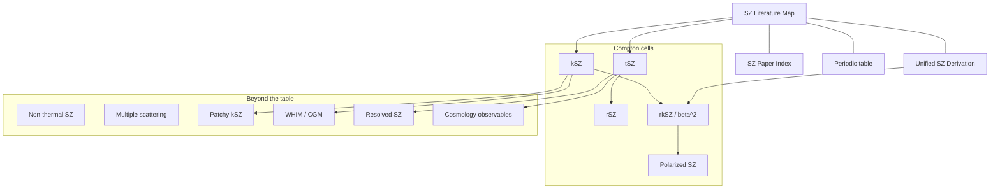

# SZ physics notes

Obsidian notes on the Sunyaev–Zeldovich effect as one Compton/Thomson operator expanded in electron temperature $`\theta_e`$ and bulk velocity $`\beta`$.

GitHub does not render Obsidian **canvas** (`.canvas`) or the **graph view** (关系图谱). This README is the online stand-in: mermaid maps plus ordinary markdown links. In Obsidian, open `SZ Periodic Table.canvas` and the local graph as usual.

**Start:** [SZ Literature Map](SZ%20Literature%20Map.md) · [Unified SZ Derivation](Unified%20SZ%20Derivation.md) · [SZ Paper Index](SZ%20Paper%20Index.md) · [Periodic table](SZ%20Periodic%20Table.md)

---

## Knowledge graph

Same edges as the Obsidian graph / canvas. Click the file list under the figure (GitHub mermaid nodes are not clickable).

| Note | File |
| --- | --- |
| Hub | [SZ Literature Map](SZ%20Literature%20Map.md) |
| Derivation | [Unified SZ Derivation](Unified%20SZ%20Derivation.md) |
| Papers | [SZ Paper Index](SZ%20Paper%20Index.md) |
| Periodic table | [SZ Periodic Table](SZ%20Periodic%20Table.md) |
| tSZ | [tSZ literature](literature/tSZ%20literature.md) |
| kSZ | [kSZ literature](literature/kSZ%20literature.md) |
| rSZ | [rSZ literature](literature/rSZ%20literature.md) |
| rkSZ, β², β³ | [rkSZ and higher kinematic](literature/rkSZ%20and%20higher%20kinematic.md) |
| Polarized SZ | [Polarized SZ literature](literature/Polarized%20SZ%20literature.md) |
| Non-thermal SZ | [Non-thermal SZ literature](literature/Non-thermal%20SZ%20literature.md) |
| Multiple scattering | [Multiple scattering and observer motion](literature/Multiple%20scattering%20and%20observer%20motion.md) |
| Patchy kSZ | [Patchy kSZ and reionization](literature/Patchy%20kSZ%20and%20reionization.md) |
| WHIM / CGM | [WHIM CGM and cosmic web](literature/WHIM%20CGM%20and%20cosmic%20web.md) |
| Resolved imaging | [Resolved SZ astrophysics](literature/Resolved%20SZ%20astrophysics.md) |
| Cosmology | [SZ cosmology observables](literature/SZ%20cosmology%20observables.md) |

---

## How to read this

1. [Unified SZ Derivation](Unified%20SZ%20Derivation.md) — one collision operator, double expansion in $`(\theta_e,\beta)`$.
2. [SZ Literature Map](SZ%20Literature%20Map.md) — what has been detected vs theory-only.
3. Probe notes in `literature/`.
4. [Mroczkowski et al. 2019](https://arxiv.org/abs/1811.02310) as the review backbone.

Obsidian users: clone the repo and open this folder as a vault. The `.canvas` file and wikilink graph still work locally; markdown links are used so GitHub can follow the same edges.
