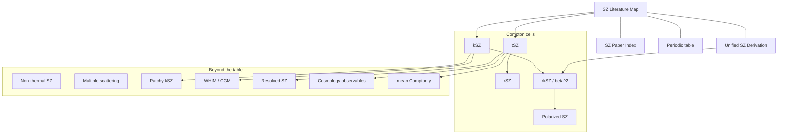

# SZ physics notes

This is the **`obsidian`** branch. Use it as a local Obsidian vault: display math is `$$...$$`, inline math is `$...$`.

GitHub's default branch is [`main`](https://github.com/licongxu/SZ_physics/tree/main). That copy uses GitHub math fences so equations render on the website. **Do not merge `main` into this branch** — those delimiters break Obsidian.

```bash
git clone https://github.com/licongxu/SZ_physics.git
cd SZ_physics
git checkout obsidian
```

Then open this folder as an Obsidian vault.

---

Obsidian notes on the Sunyaev–Zeldovich effect as one Compton/Thomson operator expanded in electron temperature $\theta_e$ and bulk velocity $\beta$.

GitHub does not render Obsidian **canvas** (`.canvas`) or the **graph view** (关系图谱). The `main` README is the online stand-in. In Obsidian, open `SZ Periodic Table.canvas` and the local graph as usual.

**Start:** [SZ Literature Map](SZ%20Literature%20Map.md) · [Unified SZ Derivation](Unified%20SZ%20Derivation.md) · [SZ Paper Index](SZ%20Paper%20Index.md) · [Periodic table](SZ%20Periodic%20Table.md)

---

## Knowledge graph

Same edges as the Obsidian graph / canvas. Click the file list under the figure (GitHub mermaid nodes are not clickable).



| Note | File |
| --- | --- |
| Hub | [SZ Literature Map](SZ%20Literature%20Map.md) |
| Derivation | [Unified SZ Derivation](Unified%20SZ%20Derivation.md) |
| Papers | [SZ Paper Index](SZ%20Paper%20Index.md) |
| Periodic table | [SZ Periodic Table](SZ%20Periodic%20Table.md) |
| tSZ | [tSZ literature](literature/tSZ%20literature.md) |
| kSZ | [kSZ literature](literature/kSZ%20literature.md) |
| rSZ | [rSZ literature](literature/rSZ%20literature.md) |
| rkSZ, β², β³ | [rkSZ and higher kinematic](literature/rkSZ%20and%20higher%20kinematic.md) |
| Polarized SZ | [Polarized SZ literature](literature/Polarized%20SZ%20literature.md) |
| Non-thermal SZ | [Non-thermal SZ literature](literature/Non-thermal%20SZ%20literature.md) |
| Multiple scattering | [Multiple scattering and observer motion](literature/Multiple%20scattering%20and%20observer%20motion.md) |
| Patchy kSZ | [Patchy kSZ and reionization](literature/Patchy%20kSZ%20and%20reionization.md) |
| WHIM / CGM | [WHIM CGM and cosmic web](literature/WHIM%20CGM%20and%20cosmic%20web.md) |
| Resolved imaging | [Resolved SZ astrophysics](literature/Resolved%20SZ%20astrophysics.md) |
| Cosmology | [SZ cosmology observables](literature/SZ%20cosmology%20observables.md) |
| Mean $\langle y\rangle$ | [Global Compton y and spectral distortions](literature/Global%20Compton%20y%20and%20spectral%20distortions.md) |

---

## How to read this

1. [Unified SZ Derivation](Unified%20SZ%20Derivation.md) — one collision operator, double expansion in $(\theta_e,\beta)$.
2. [SZ Literature Map](SZ%20Literature%20Map.md) — what has been detected vs theory-only.
3. Probe notes in `literature/`.
4. [Mroczkowski et al. 2019](https://arxiv.org/abs/1811.02310) as the review backbone.

Daily editing belongs on this `obsidian` branch. After you change notes, update `main` separately if you want GitHub math to stay in sync — the two branches use different math delimiters on purpose.
