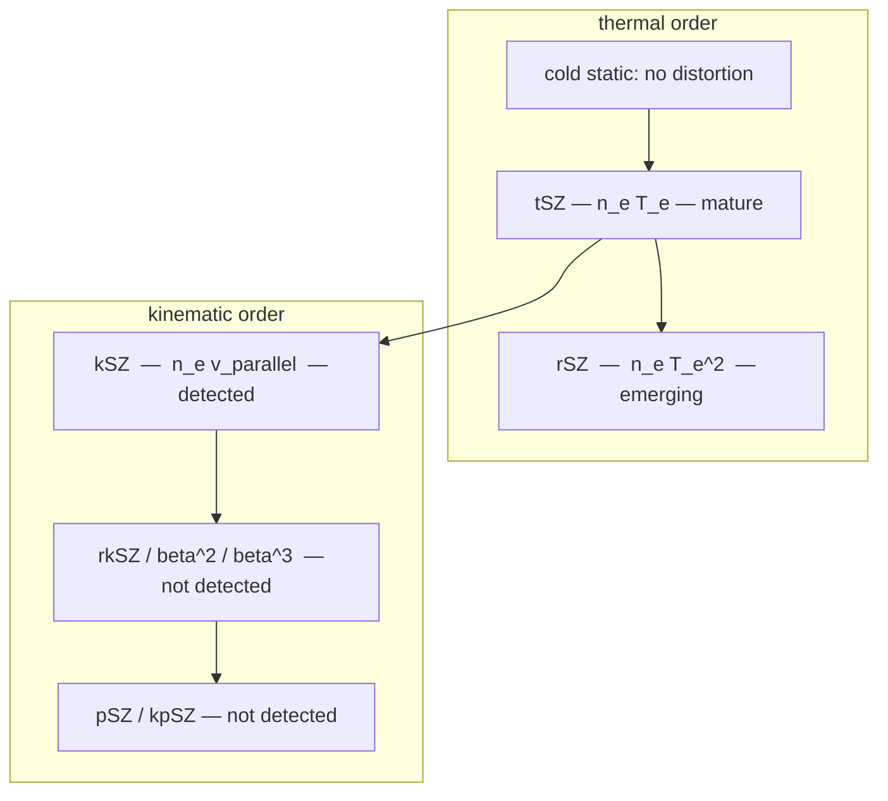
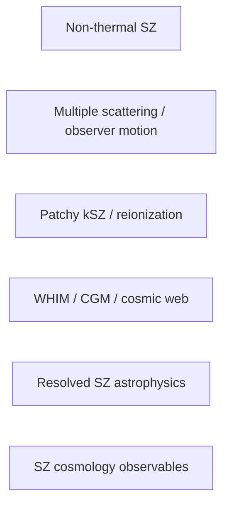

# SZ periodic table

GitHub cannot render Obsidian `.canvas` files. This page is the same map as `SZ Periodic Table.canvas` (open that file in Obsidian). Hub: [SZ Literature Map](SZ%20Literature%20Map.md).

## Compton cells

Rows are bulk-velocity order $\beta^m$. Columns are thermal order $\theta_e^k$.

|  | theta_e^0 | theta_e^1 | theta_e^(2+) |
| --- | --- | --- | --- |
| beta^0 | 0 (cold static) | [tSZ literature](literature/tSZ%20literature.md) | [rSZ literature](literature/rSZ%20literature.md) |
| beta^1 | [kSZ literature](literature/kSZ%20literature.md) | [rkSZ and higher kinematic](literature/rkSZ%20and%20higher%20kinematic.md) | higher rkSZ |
| beta^2 | [rkSZ and higher kinematic](literature/rkSZ%20and%20higher%20kinematic.md) (beta^2) | beta^2 rSZ | … |
| pol. | [Polarized SZ literature](literature/Polarized%20SZ%20literature.md) | thermal pol. | … |

## Beyond Maxwellian cells

- [Non-thermal SZ literature](literature/Non-thermal%20SZ%20literature.md)
- [Multiple scattering and observer motion](literature/Multiple%20scattering%20and%20observer%20motion.md)
- [Patchy kSZ and reionization](literature/Patchy%20kSZ%20and%20reionization.md)
- [WHIM CGM and cosmic web](literature/WHIM%20CGM%20and%20cosmic%20web.md)
- [Resolved SZ astrophysics](literature/Resolved%20SZ%20astrophysics.md)
- [SZ cosmology observables](literature/SZ%20cosmology%20observables.md)
- [Global Compton y and spectral distortions](literature/Global%20Compton%20y%20and%20spectral%20distortions.md)

## Detection snapshot (mid-2026)

- **tSZ:** mature (Planck 1203 confirmed; ACT/SPT thousands; C_ell^yy 9.3σ SPT-3G)
- **kSZ:** pairwise 9.3σ; stack 13σ; **one** resolved cluster (MACS J0717)
- **rSZ:** stacked T_e few-σ (ACT 8.5±2.4 keV); systematics ≈ stats
- **rkSZ, β², β³, pSZ, kpSZ, ntSZ, multiple scattering:** not detected
- **filaments:** stacked tSZ 5.3σ (Tanimura+2019)
- **patchy kSZ:** high-ℓ power seen; EoR vs late-time split open
